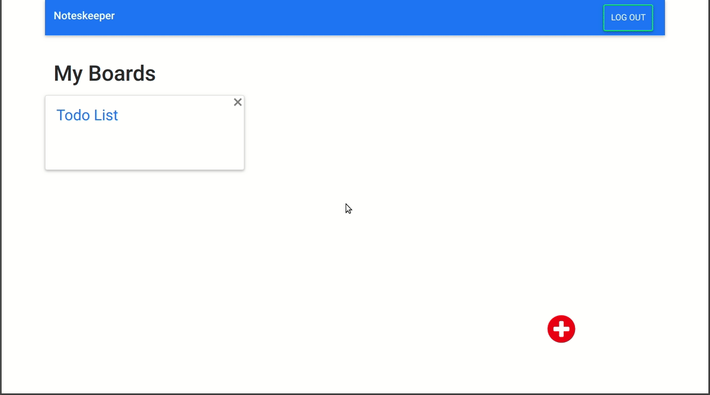

# Noteskeeper

### Summary:
This is a Trello clone that allows you to create boards and add notes to them! In addition, you can drag fields and reorder cards. 

Check it out over here: https://noteskeeper.herokuapp.com/

### Demo:

### Skills used:

- Creating new objects such as boards, lists, and cards
- Database design and querying
- Handling multiple nested input types
- Building an API
- Authentication (Google OAuth)
- React
- Routing
- Form validation
- Node JS (Express)
- MongoDB/Mongoose
- Bootstrap
