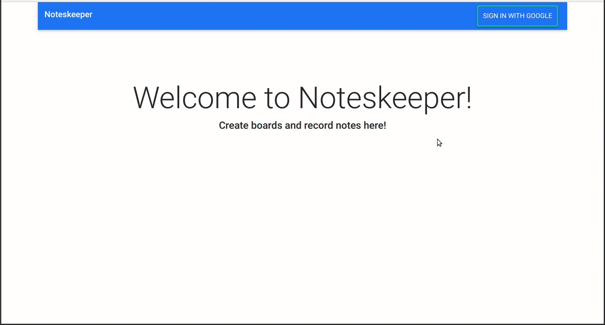

# Noteskeeper

Summary:
Allows you to create boards and add notes to them!

Demo:

Skills used:

- Creating new objects such as boards, lists, and cards  
- Database design and querying
- Handling multiple nested input types
- Building an API
- Authentication (Google OAuth)
- React
- Routing
- Form validation
- Node JS (Express)
- MongoDB/Mongoose
- Bootstrap
